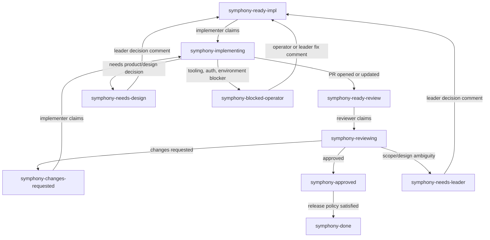

# Role Workflow Model

Symphony role workflows model a GitHub-first production line. The core
abstraction is not a fixed set of job titles. It is a graph of states,
roles, actors, transitions, and gates.

This document describes the product model that should replace prompt-only
role conventions. GitHub issues, PRs, labels, and comments remain the source
of truth. GitHub Projects may mirror status, but they must not be required for
routing.

## Product Objects

| Object | Meaning |
| --- | --- |
| Role | A named responsibility boundary, such as `implementer`, `reviewer`, or `leader`. |
| Actor | Who performs the role: `agent`, `human`, or `hybrid`. |
| State | A routable issue or PR state represented by labels. |
| Transition | A permitted move from one state to another. |
| Gate | A state that requires a specific role to make or record a decision. |
| Audit policy | The comment/evidence required before a transition is accepted. |

Roles define what work can be claimed. States define where work currently is.
Transitions define what a role is allowed to change.

## Scheduler Contract

The role graph is a scheduler contract. It is not just documentation and it is
not just prompt text.

The scheduler is responsible for:

1. resolving the current state from tracker labels;
2. selecting the role allowed to claim that state;
3. skipping states owned by human actors;
4. creating the claim transition;
5. rendering the role-specific prompt for agent actors;
6. collecting outcome evidence from the run;
7. validating that the requested transition is allowed for the active role;
8. applying source and destination label changes;
9. writing or verifying required audit evidence;
10. exposing the next actor and gate owner in status surfaces.

The agent is responsible for execution inside that boundary:

1. inspect the issue, PR, comments, and workspace;
2. make code or review changes allowed by the role;
3. produce evidence such as a PR link, review summary, design proposal, or
   blocker explanation;
4. report one of the role's allowed outcomes with
   `Symphony-Role-Outcome: <transition_name>`.

An agent should not be trusted to decide arbitrary tracker transitions. If an
agent reports an outcome that is not permitted by the role graph, Symphony must
leave the issue in a safe gate state and surface the mismatch.

Agents must not apply Symphony state labels directly. A reviewer may approve a
PR or leave requested-change comments; a leader may write a decision comment;
an implementer may open or update a PR. Symphony owns the source/destination
label changes after it validates that the reported outcome is allowed from the
active role and state.

## Minimal Production Roles

The recommended production preset has three roles. Teams may rename or split
them, but the workflow must still encode ownership of implementation, review,
and decision gates.

| Role | Default actor | Owns | Must not do |
| --- | --- | --- | --- |
| Implementer | Agent | Code changes, tests, PR creation, PR updates after requested changes. | Mark an open issue done, approve its own PR, clear design gates. |
| Reviewer | Human or agent | PR review, quality gate, requested changes, approval recommendation. | Implement non-trivial fixes unless explicitly configured. |
| Leader | Human, agent, or hybrid | Product/design decisions, issue splitting, stalled work, gate overrides. | Silently unblock without an auditable comment. |

Other roles are refinements of these boundaries:

| Optional role | Usually split from |
| --- | --- |
| Planner | Leader |
| Fixer | Implementer |
| Verifier | Reviewer |
| Release | Reviewer or Leader |
| Operator | Leader |

## State Graph

Default production states should be explicit role handoffs:



`symphony-done` is terminal. Opening or updating a PR is not terminal; it is a
handoff from implementation to review.

## Gate Ownership

Blocked states are not generic. Each gate has an owner role and an unblock
rule.

| Gate state | Owner role | Unblock requirement | Next state |
| --- | --- | --- | --- |
| `symphony-needs-design` | Leader | Comment with concrete design decision or issue split. | `symphony-ready-impl` |
| `symphony-needs-leader` | Leader | Comment resolving scope, priority, duplicate PR, or ownership conflict. | `symphony-ready-impl` or `symphony-ready-review` |
| `symphony-blocked-operator` | Operator or Leader | Comment explaining the environmental fix. | `symphony-ready-impl` |
| `symphony-changes-requested` | Implementer | PR update addressing review comments. | `symphony-ready-review` |

A role may only clear gates it owns. If a role needs a decision it does not
own, it must route to the owning gate instead of guessing.

## Transition Rules

Every transition has three parts:

1. Source labels to remove.
2. Destination labels to add.
3. Audit evidence to write or verify.

Examples:

| Transition | Remove | Add | Required evidence |
| --- | --- | --- | --- |
| Claim implementation | `symphony-ready-impl` | `symphony-implementing` | Claim comment with run id. |
| PR delivered | `symphony-implementing` | `symphony-ready-review` | PR link comment. |
| Design needed | `symphony-implementing` | `symphony-needs-design` | Issue comment with concrete question/proposal. |
| Review changes requested | `symphony-reviewing` | `symphony-changes-requested` | PR review or issue comment listing required changes. |
| Review approved | `symphony-reviewing` | `symphony-approved` | PR approval or review summary. |
| Leader unblocks design | `symphony-needs-design` | `symphony-ready-impl` | Leader decision comment. |
| Complete issue | `symphony-approved` | `symphony-done` | Merge/close evidence, or explicit terminal no-work decision. |

Label updates should be performed together where the tracker API allows it.
GitHub REST label operations are not fully atomic, so Symphony must tolerate
intermediate states by excluding active and gate labels during candidate
selection.

## Agent Outcome Contract

Agent-owned roles request transitions by emitting exactly one terminal marker
after they have produced the required GitHub-visible evidence:

```text
Symphony-Role-Outcome: approved
```

The value must be one of the active role's allowed transition names. Symphony
parses the marker into `task_outcome=completed_role_outcome`, records
`role_outcome=<transition>`, validates the transition against the role graph,
and applies the label handoff. If the marker names a transition owned by
another role, Symphony routes the issue to the role's configured escalation
transition such as `needs_leader`, or to the operator blocked label if no safe
role transition exists.

Examples:

| Role | Evidence first | Terminal marker |
| --- | --- | --- |
| Reviewer approves | Leave a PR approval or review summary. | `Symphony-Role-Outcome: approved` |
| Reviewer requests changes | Leave review comments describing required changes. | `Symphony-Role-Outcome: changes_requested` |
| Reviewer escalates | Comment why design/scope needs leader input. | `Symphony-Role-Outcome: needs_leader` |
| Leader unblocks | Comment the concrete decision. | `Symphony-Role-Outcome: decision_to_impl` |

Humans participate by moving labels at gates where the actor is `human`.
Human intervention should be reserved for states that actually require human
judgment; routine review can be assigned to an agent reviewer.

## Actor Modes

A role can be handled by an agent, a human, or both.

| Actor | Behavior |
| --- | --- |
| `agent` | Symphony may claim matching work and perform allowed transitions. |
| `human` | Symphony must not claim the state; it may only observe and surface dashboard status. |
| `hybrid` | Symphony may draft recommendations, but a human-owned approval marker is required before unblocking. |

This keeps the model useful for teams where humans are reviewers or leaders.
Human roles are still part of the graph, so the system can explain what is
waiting and who owns the next move.

## Configuration Sketch

The final schema may differ, but it should preserve these concepts:

```yaml
roles:
  implementer:
    actor: agent
    provider: claude_code
    can_claim: [ready_impl, changes_requested]
    claim_state: implementing
    transitions:
      pr_delivered:
        from: implementing
        to: ready_review
        requires: pr_link
      design_needed:
        from: implementing
        to: needs_design
        requires: issue_comment
      operator_blocked:
        from: implementing
        to: blocked_operator
        requires: issue_comment

  reviewer:
    actor: human
    can_claim: [ready_review]
    claim_state: reviewing
    transitions:
      changes_requested:
        from: reviewing
        to: changes_requested
        requires: review_comment
      approved:
        from: reviewing
        to: approved
        requires: [pr_approval, pr_merged]
      needs_leader:
        from: reviewing
        to: needs_leader
        requires: issue_comment

  leader:
    actor: hybrid
    can_claim: [needs_design, needs_leader, blocked_operator]
    claim_state: leader_reviewing
    transitions:
      decision_to_impl:
        from: [needs_design, needs_leader, blocked_operator]
        to: ready_impl
        requires: decision_comment

states:
  ready_impl:
    labels: [symphony-ready-impl]
  implementing:
    labels: [symphony-implementing]
  ready_review:
    labels: [symphony-ready-review]
  reviewing:
    labels: [symphony-reviewing]
  changes_requested:
    labels: [symphony-changes-requested]
  needs_design:
    labels: [symphony-needs-design]
    gate_owner: leader
  needs_leader:
    labels: [symphony-needs-leader]
    gate_owner: leader
  blocked_operator:
    labels: [symphony-blocked-operator]
    gate_owner: leader
  approved:
    labels: [symphony-approved]
  done:
    labels: [symphony-done]
    terminal: true
```

## Presets

Presets should compile to the same role graph model.

| Preset | Intended use |
| --- | --- |
| `solo-agent` | One agent does simple implementation work. It still routes PR delivery to a review/waiting state instead of done. |
| `human-review` | Agent implements; human reviews and approves; leader gates are human-owned. |
| `production-line` | Implementer, reviewer, leader, verifier, and release roles are explicit. |

The default production recommendation should be `human-review` or
`production-line`. `solo-agent` is for low-risk repositories and should be
documented as less reliable.

## Dashboard Requirements

The dashboard should show:

- current role;
- current state;
- gate owner, when blocked;
- next expected actor;
- last transition evidence;
- linked PR and review status.

An operator should not have to infer ownership from raw labels.

## Backward Compatibility

Existing single-lane workflows remain valid. Compatibility mapping:

| Existing label | Role-graph meaning |
| --- | --- |
| `symphony-ready` | `ready_impl` |
| `symphony-running` | `implementing` |
| `symphony-blocked` | `blocked_operator` unless a more specific reason is available |
| `symphony-done` | `done` |

New init templates should prefer role-specific labels. Existing templates may
keep the compatibility labels until the role graph implementation is complete.

## Non-Goals

This model does not require:

- a database;
- Linear support;
- Codex support;
- GitHub Projects;
- automatic merge authority for implementation or review agents;
- fixed role names across all teams.

The required invariant is explicit ownership: for every state, Symphony must
know who can claim it, who can unblock it, and what evidence is required to
move it forward.
